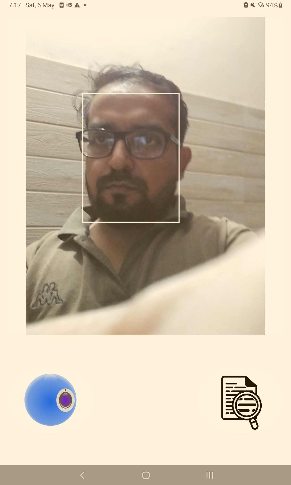
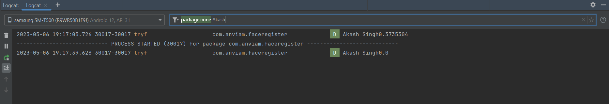

# Face-Detection-And-Recognition
This is a sample app built to demonstrate use of MLKit Face detection . Dedicated to all Android Developers 

# About
- CameraX : Detects multiple faces using camerax preview.
- MLKIT : ML Kit to detect faces in images and video.
# Welcome Screen

#Find faces in pictures
- Register Images by camera or gallery 

- Helping of MLKIT and CAMERAX Recogntion images on live camera

#Result Logs: 

